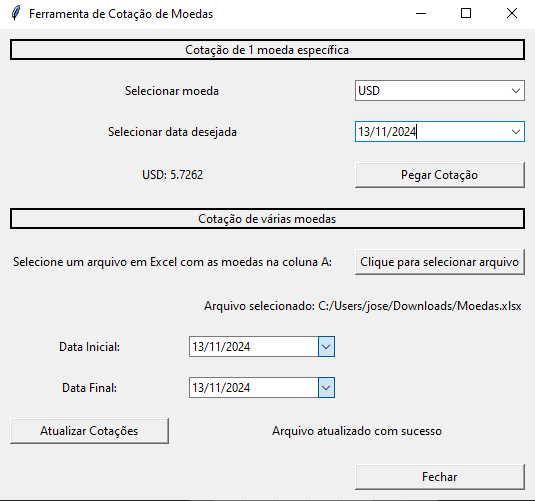

# CotacaoMoedas
 Um app desktop com Tkinter (Python) que pega cotações de diversas moedas com uso de api da awesomeAPI. Também é capaz de atualizar uma planilha em excel.

 

# Instalação de dependências
Rode o comando no terminal: `pip install -r requirements.txt`

# Para rodar

Basta rodar o arquivo "SistemaCotacao.py"

Comando de terminal:

`python SistemaCotacao.py`

Caso não vá o primeiro comando:

`python3 SistemaCotacao.py`

 # Contriubuições
Contribuições são muito bem vindas!
